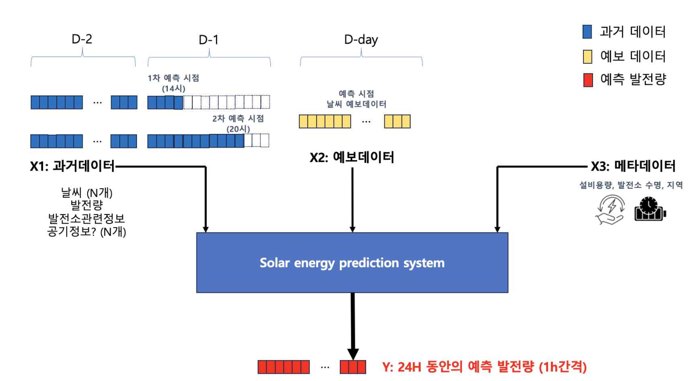

# renewable-power-prediction
2025 제13회 공공데이터 활용 아이디어 공모전 데이터 분석 과제 4
(https://datacontest.kr/apply/applyAdd/3)

### 다중 모달리티 기반 태양광 발전량 예측 AI 알고리즘 개발

### [1] Overview

"재생에너지 발전량 예측제도"는 재생에너지 발전의 변동성을 관리하고 전력망의 안정성을 유지하기 위해 발전량을 사전 예측하는 제도로서, 예측한 발전량과 실제 발전량을 비교하여 오차율에 따라 참여 발전사업자에게 추가 정산금을 지급합니다. 해당 제도는 정산금 지급 기준인 오차율을 줄이는 방향으로 단계적으로 강화되고 있어, 중소 사업자의 부담 증가와 기업간 양극화가 우려되고 있습니다. 
본 프로젝트는 AI를 이용한 태양광 발전량 예측 알고리즘을 개발하여 재생에너지 발전량, 기상청 일조량, 일사량, 풍속 등의 공공데이터를 활용한 지역별 재생에너지 발전량 예측모델을 개발하고 중소사업자에게 서비스 배포하여 어려움을 해소하고자 합니다.

### [2] System Architecture 
#### 전체 시스템 구조

* 입력 데이터 (3가지 그룹)
- X1 (과거 48시간 데이터): 예측 대상 D-day 이전 48시간의 과거 발전량 데이터
- X2 (D-day 예보 데이터): 예측 대상 D-day의 기상 예보 등 예측 관련 데이터
- X3 (메타데이터): 각 발전소의 고유한 특성을 나타내는 데이터

* 출력 데이터
- Y: D-day 당일 시간별 예측 발전량 데이터 (24시간)

#### 모델 구조

Transformer + PatchTSMixer 기반 모델 사용
- Multi-Modal Data Fusion: Historical 데이터, Weather 예보, Plant Meta 데이터의 효과적 결합
- 시간 정보 보존: Transformer Encoder로 48시간 과거 데이터의 모든 시간 정보 보존
- 선택적 정보 추출: Cross Attention을 통한 24시간 예측 시점별 최적의 context 추출
- 시계열 특화 처리: PatchTSMixer의 Channel/Temporal mixing으로 시계열 고유 특성 모델링

### [3] Project Structure

renewable-power-prediction/
├── data/                                  # 데이터 저장 폴더
├── data_preprocessing/                    # 데이터 전처리 관련 파일
│   ├── merge_datas/                       # 태양광 발전량 데이터 + 날씨 데이터 + 기상 예보 데이터 병합
│   ├── solar_energy/                      # 태양광 발전량 데이터 처리
│   ├── weather_data/                      # 날씨 데이터 처리
│   └── weather_forecast_data/             # 기상 예보 데이터 처리
├── modeling/                             # 모델링 관련 파일
│   ├── modeling.py                       # 훈련 코드
│   ├── run_experiments.sh                # 실험 실행 스크립트
│   ├── complete_solar_prediction_model.py # Transformer 인코더 기반 최종 예측 모델
│   └── simple_solar_model.py             # CNN 인코더 기반 간단한 예측 모델
├── result_analysis/                      # 결과 분석 모듈
├── README.md
└── requirements.txt                      # 패키지 의존성

### [4] How to run

1. 환경설정
pip install -r requirements.txt

2. 모델 학습 실행
# 실험 스크립트 실행
cd modeling
./run_experiments.sh